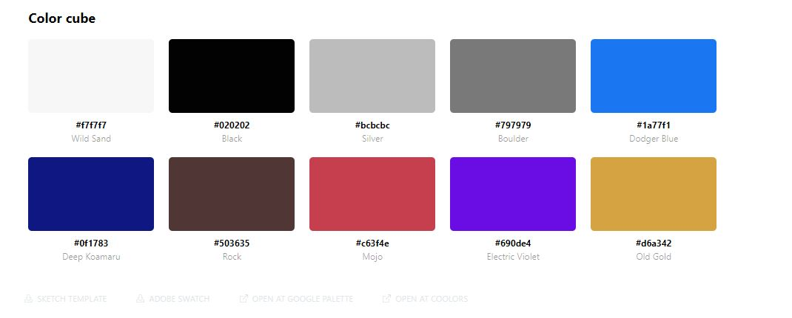

# Stephen Clark README for VWC

## Week Two Day 4 Exercise

1. Pick your favorite site
2. Use [site pallet](http://palette.site/) plugin on it
3. Save that palette in your readme of your personal site
4. Read the [intro of CSS Box model](https://developer.mozilla.org/en-US/docs/Web/CSS/CSS_Box_Model/Introduction_to_the_CSS_box_model)
5. Using what you read, use CSS to make a box model with the colors you picked.
- #f7f7f7 Wild Sand
- #020202 Black
- #bcbcbc Silver
- #797979 Boulder
- #1a77f1 Dodger Blue
- #0f1783 Deep Koamaru
- #503635 Rock
- #c63f4e Mojo
- #690de4 Electric Violet
- #d6a342 Old Gold

